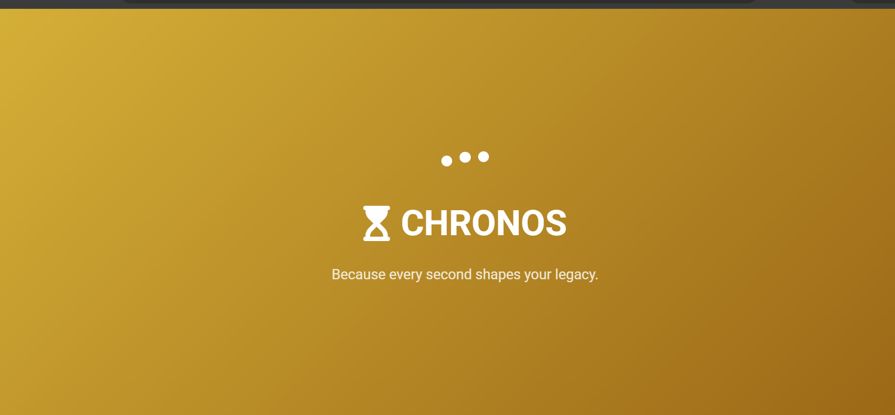

# Chronos Age Calculator - Premium Edition




[](https://azmi-adan.github.io/CodeAlpha_AgeCalculator/)

A premium age calculator with advanced features and a customizable interface.

---

## 📘 Table of Contents
- [Project Overview](#project-overview)
- [Features](#features)
- [Technologies Used](#technologies-used)
- [Installation](#installation)
- [Usage](#usage)
- [Customization](#customization)
- [Performance](#performance)
- [Accessibility](#accessibility)
- [Contributing](#contributing)
- [License](#license)
- [Acknowledgements](#acknowledgements)

---

## 🧩 Project Overview

Chronos Age Calculator is a responsive web application that calculates precise age in years, months, and days from a given birth date. Designed with professionals in mind, it offers:

- Sleek, modern interface  
- Advanced age calculation algorithms  
- Customizable appearance  
- Multilingual support  
- Detailed age statistics  

---

## 🚀 Features

### ✅ Core Functionality
- **Precise Age Calculation** – Calculates exact age in years, months, and days  
- **Additional Information**:
  - Next birthday countdown  
  - Day of the week born  
  - Total days lived  
- **Birthday Detection** – Special celebration animation when it's the user's birthday  

### 🎨 Customization
- **Multiple Themes** – Default, Luxury, Ocean, and Forest  
- **Font Selection** – Montserrat, Roboto, Poppins, or Arial  
- **Animation Toggle** – Enable/disable celebratory animations  
- **Language Support** – English, Español, Français, Deutsch  

### 🧠 User Experience
- **Splash Screen** – Elegant loading animation  
- **Responsive Design** – Works on all device sizes  
- **Error Handling** – Validates input with helpful messages  
- **Share Functionality** – Share results via social media or copy to clipboard  

---

## 💻 Technologies Used

### 🌐 Frontend
- **HTML5** – Semantic markup  
- **CSS3** – Variables, animations, responsive design  
- **JavaScript** – Vanilla JS implementation  
- **Font Awesome** – Icon library  
- **Google Fonts** – Montserrat, Roboto, Poppins  

### 🧰 Development Tools
- **Git & GitHub** – Version control and deployment  
- **VS Code** – Primary development environment  

---

## 🛠️ Installation

To run this project locally:

```bash
git clone https://github.com/Azmi-Adan/CodeAlpha_AgeCalculator.git
cd CodeAlpha_AgeCalculator


## Navigate to the Project Directory

```bash
cd CodeAlpha_AgeCalculator
```

## Open `index.html` in Your Browser

```bash
# On macOS:
open index.html

# On Windows:
start index.html
```

Or simply visit the [Live Demo](#).

---

## 🧪 Usage

* Enter your birth date (day, month, year)
* Click **"Calculate Age"**
* View your:

  * Exact age (years, months, days)
  * Next birthday
  * Birth day of the week
  * Total days lived

---

## ⚙️ Customization

Access settings via the gear icon (⚙️) in the footer to:

* Change theme color scheme
* Select preferred font
* Toggle animations
* Switch language

*All preferences are saved automatically.*

---

## ⚡️ Performance

Optimized for fast loading:

* Minimal dependencies
* Efficient JavaScript
* Compressed assets
* Lazy loading where applicable

---

## ♿️ Accessibility

Built with accessibility in mind:

* Semantic HTML
* Keyboard navigation support
* Color contrast compliant
* Screen reader friendly

---

## 📆 Contributing

Contributions are welcome! Please follow these steps:

1. Fork the repository
2. Create your feature branch:

   ```bash
   git checkout -b feature/AmazingFeature
   ```
3. Commit your changes:

   ```bash
   git commit -m "Add some AmazingFeature"
   ```
4. Push to the branch:

   ```bash
   git push origin feature/AmazingFeature
   ```
5. Open a Pull Request

---

## 📄 License

Distributed under the MIT License. See `LICENSE` for more information.

---

## 📏 Acknowledgements

* **CodeAlpha** for the internship opportunity
* **Font Awesome** for icons
* **Google Fonts** for typography
* All open source libraries used
